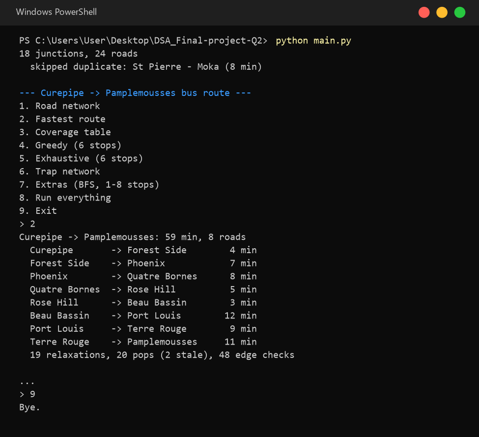
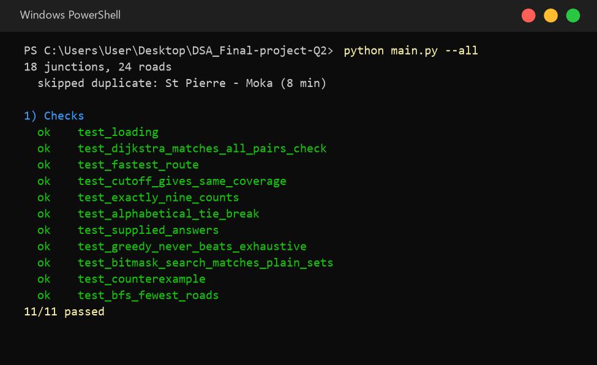
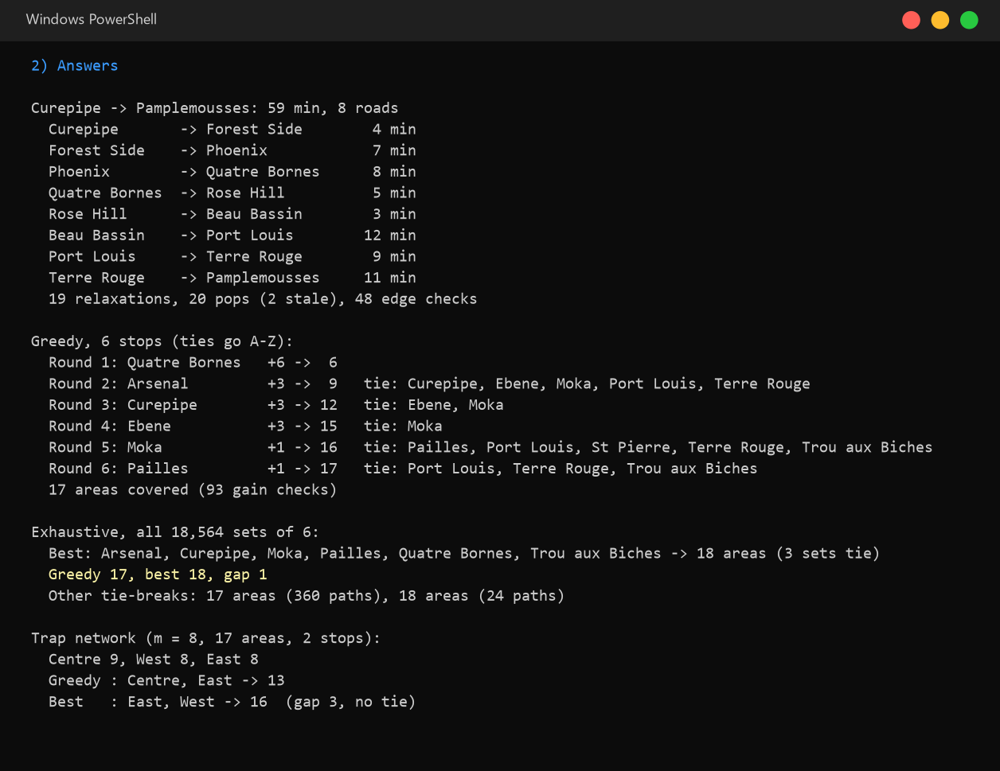
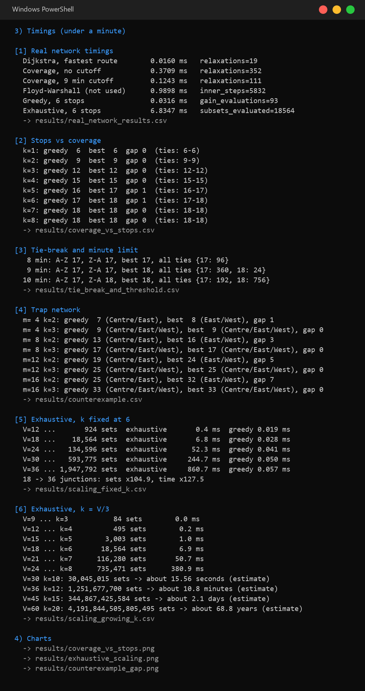
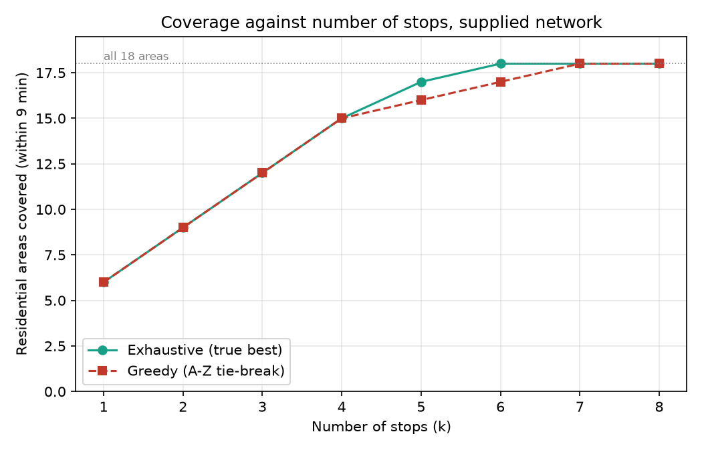
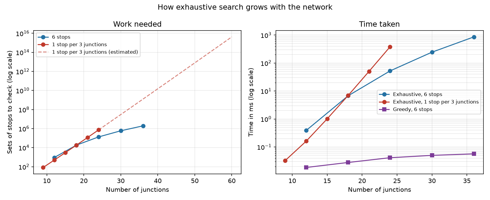
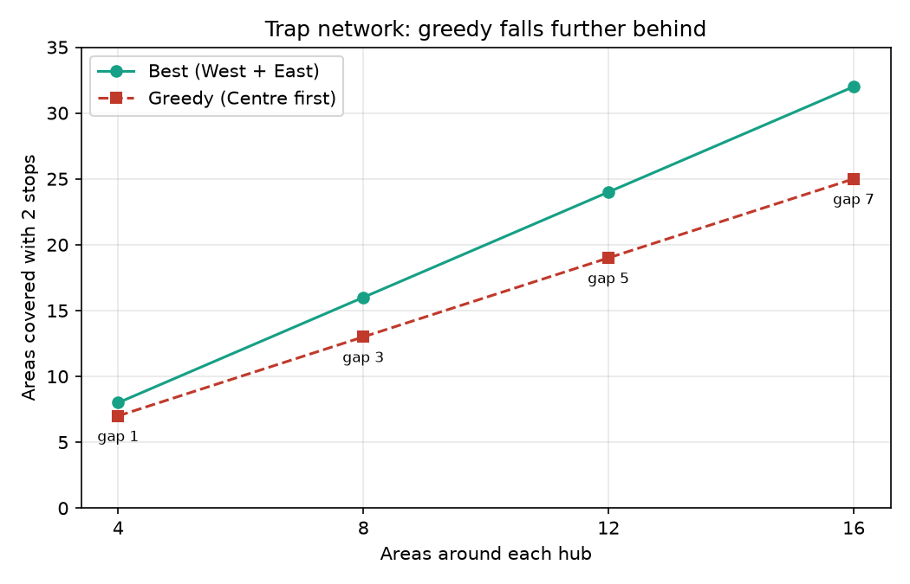

# DSA Final Project, Question 2: A new bus route and where to put the stops

This project models the Mauritius road network as a weighted graph.
I used it to answer two questions:

1. **What is the fastest bus route from Curepipe to Pamplemousses?** We answer this with Dijkstra's algorithm.
2. **Where should we put six bus stops so that as many residential areas as possible are covered?**
   An area is covered if the shortest travel time between a stop and the area's junction is
   **at most nine minutes (exactly 9 counts)**. We answer this with the greedy rule the question asks for,
   and we compare it against an exhaustive search over all C(18, 6) = 18,564 ways to pick six stops.

The point is to show, with real numbers and not just the theory, when a greedy rule is good enough and why it can never be guaranteed to find the best answer.

## Running it

You need **Python 3.10 or newer** and **matplotlib** (only for the charts; without it everything else still runs).

```bash
python -m pip install -r requirements.txt
python main.py --all      # checks, answers, timings, CSVs and charts (under a minute)
python main.py            # interactive menu
```

Each file can also be run on its own, for example `python tests.py` for just the checks.
CSVs and charts are written to the `results/` folder.

## What it looks like

### The menu

Running `python main.py` opens a menu. Here option 2 prints the fastest route:



### Correctness checks

`--all` runs 11 checks before anything else. If any of them fails the program stops, since timing wrong code is pointless.



### The answers

The fastest route is **59 minutes over 8 roads**. Greedy places its six stops round by round and the ties are printed
next to each pick, so you can see exactly where the alphabetical tie-break made a decision. Greedy reaches **17 of 18**
areas, while the exhaustive search finds sets that cover **all 18**.



The gap of 1 comes from round 4: Ebene and Moka both add 3 areas and A-Z picks Ebene. Picking Moka there and
Trou aux Biches later would have covered everything. Out of every possible way to break the ties, 360 end on 17 and
24 end on 18.

The trap network at the bottom is one we built ourselves to show that the problem is not only the tie-break. A "Centre"
hub covers the most areas on its own, so greedy takes it first with no tie at all, but the two outer hubs
(West + East) together cover more. Greedy ends on 13 and the best is 16.

### Timings

Every timing is the median of 5 runs after warm-up, with garbage collection switched off, and very fast functions
are run many times in a batch. Operation counts are printed next to each time because they don't depend on the machine.



A few things worth pointing out:

- Stopping each Dijkstra at 9 minutes cuts the coverage table from **352 relaxations to 111**, and gives the same table.
- Floyd-Warshall always does V³ = 5,832 steps no matter how few roads there are, which is why we only use it to check Dijkstra.
- Greedy finishes in about 0.03 ms. Exhaustive needs about 7 ms for the same 6 stops, roughly 200 times slower.
- Changing the limit to 8 or 10 minutes changes the answer (section [3]), so the result depends on that cut-off.

## The charts

### Greedy vs best coverage



For 1 to 4 stops the two lines sit on top of each other. Greedy falls one area behind at 5 and 6 stops, then both
reach all 18 areas from 7 stops onward. So on this network greedy is never far off, but it does miss the best answer
for exactly the number of stops the question asks about.

### How exhaustive search grows



These use random networks with the same density as the real one. The left chart counts the sets that need checking,
the right one shows the measured time.

- **Blue (6 stops fixed):** the work grows like V⁶. Doubling the network from 18 to 36 junctions means about 105 times
  more sets and about 128 times more time. Slow, but still possible.
- **Red (1 stop per 3 junctions):** when the number of stops grows with the network, the growth is exponential. The
  dashed line is the estimate: about 11 minutes at 36 junctions, 2 days at 45 and almost 69 years at 60.
- **Purple (greedy):** stays well under a millisecond the whole way.

### The trap network



As the number of areas around each hub (m) grows, greedy keeps choosing Centre first and the gap grows as
m/2 − 1: 1, 3, 5 and 7. There is no limit to how far behind greedy can fall on a network shaped like this.

## Project structure

```text
DSA_Final-project-Q2/
├── main.py                  menu, and --all to run everything
├── road_network.py          loads the CSVs, builds random and trap networks
├── shortest_paths.py        Dijkstra (binary heap), BFS, Floyd-Warshall
├── stop_placement.py        9-minute coverage table, greedy, exhaustive (bitmasks)
├── tests.py                 11 correctness checks
├── benchmark.py             timings, operation counts, CSVs and charts
├── Q2_road_network.csv      25 rows of roads with travel times (minutes)
├── Q2_residential_areas.csv 18 residential areas and their junctions
├── requirements.txt
├── screenshots/             terminal output used in this README
└── results/                 CSVs and charts written by benchmark.py
```

## Assumptions about the data

- **Every road is two-way**, as the question says.
- **The road CSV has 25 rows but only 24 real roads.** "Moka, St Pierre, 8" and "St Pierre, Moka, 8" are the same road
  written twice, so we keep it once and print a note when loading.
- **Exactly 9 minutes counts as covered**, so the code uses `<=`.
- **Stops can only go on the 18 junctions**, and each area is covered through the junction it sits at.
- **Greedy ties go to the alphabetically first junction.**
- **Travel times can't be negative**, since Dijkstra needs that. The loader stops with an error if one is.

## Limitations

- Travel times are fixed. There is no traffic, time of day, or waiting at stops.
- Coverage is all or nothing at 9 minutes. An area 9.5 minutes away counts the same as one an hour away.
- Every area counts the same. We don't weight areas by how many people live there.
- Exhaustive search only works because 6 out of 18 is small. The scaling charts show it stops being usable quickly.
- The random networks used for scaling only match the real network's density, they are not real road maps.

The report discusses these in more detail.
